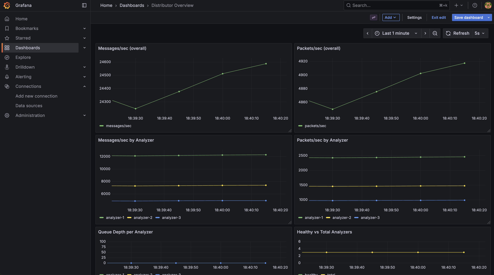

# Log Streamer Distributor

A high-performance log distribution system built in Go that routes log packets to multiple analyzers based on configured distribution weights with health checking and failure recovery.

## Architecture

The system consists of:

- **Distributor**: HTTP service that receives log packets and routes them to analyzers
- **Analyzers**: Multiple analyzer services that process log packets
- **Emitter**: Load generator for testing the system

## Features

- **Weighted Message-Based Routing**: Atomically distributes packets (containing one or more message) to analyzers based on a specified message weight distribution.
- **Health Checking**: Monitors analyzer health and automatically removes unhealthy analyzers
- **Failure Recovery**: Automatically re-adds analyzers when they become healthy again
- **Metrics**: Built-in metrics endpoints for monitoring analyzers
- **Observability**: Prometheus metrics integration with Grafana dashboards
- **Circuit Breaker**: Prevents cascading failures with configurable failure thresholds

## Quick Start

### Using Docker Compose

1. **Build and start all services (emitter, distributor, analyzers, monitoring):**
   ```bash
   docker-compose up --build -d
   ```
   
   This starts:
   - **Core Services**: Distributor, 3 analyzers with weights (0.5, 0.3, 0.2), emitter (~5k packets/sec * 5 messages/packet)
   - **Monitoring Stack**: Prometheus, Grafana
   - **Auto-configuration**: Datasources and dashboards

2. **Check the status:**
   ```bash
   # Check distributor health
   curl http://localhost:8080/health
   
   # Check JSON metrics
   watch -n 1 'curl -s http://localhost:8080/metrics-json | jq'
   
   # Check Prometheus metrics
   curl http://localhost:9100/metrics
   ```

3. **Access monitoring dashboards:**
   - **Grafana**: http://localhost:3000 (admin/admin, navigate to Dashboards -> Distributor Dashboards, metrics take about ~15s to stabilize and refresh every 5s)
   - **Prometheus**: http://localhost:9090

   

4. **Send test packets:**
   ```bash
   curl -X POST http://localhost:8080/ingest \
     -H "Content-Type: application/json" \
     -d '{
       "emitter_id": "test-emitter",
       "packet_id": "test-packet-1",
       "messages": [
         {
           "timestamp": 1640995200000,
           "level": "INFO",
           "message": "Test log message",
           "metadata": {"service": "test"}
         }
       ]
     }'
   ```

5. **Test failure scenarios and observe in Grafana:**
   ```bash
   # Stop one analyzer to simulate failure
   docker-compose down analyzer-1
   
   # Watch the Grafana dashboard at http://localhost:3000
   # You should see:
   # - Healthy analyzers count drop from 3 to 2
   # - Traffic redistribution to remaining analyzers
   # - Possible queue depth changes as traffic rebalances
   # - Recovery metrics when analyzer comes back online
   
   # Restart the analyzer to test recovery
   docker-compose up analyzer-1
   
   # Observe in Grafana how traffic gradually rebalances
   # back to the original distribution weights
   ```

## Testing

### Testing the System

**Run test.sh:**
```bash
./test.sh
```

This comprehensive test suite validates:
- High throughput (with O(10k) messages/second)
- Message-based routing algorithm with mixed packet sizes
- Weight distribution by message count, not packet count
- Failure detection and recovery scenarios
- Weight redistribution when analyzers go offline
- System health monitoring and metrics collection

### Missing tests/future improvements

* Sender retry & circuit-breaker transitions
* Stress tests until analyzer queues fill; verify backpressure (503) returns promptly
* Latency testing under various load conditions
* Memory usage monitoring during high load
* Add latency injection to simulate slow analyzers
* Simulate flapping analyzers (rapid start/stop cycles)
* Network partition testing
* Memory pressure and GC pause simulation

## Design

We achieve the three requirements for the distributor in our design:

**High-throughput**: Achieved in the common case by decoupling network IO from routing and fast in-memory channels. Throughput can be limited by downstream analyzers, channel sizing, or our single-router bottleneck under extreme load.

**Non-blocking**: Mostly non-blocking for accept-paths (fast-path enqueue + buffered channels + short-block fallback). The HTTP handler can block briefly waiting for enqueue confirmation; this is deliberate backpressure alleviation.

**Thread-safe distribution**: Achieved via channels, a single-router model, and atomic counter updates, which minimize race conditions.

### Assumptions made in the distributor design

* Packets must remain atomic (no splitting) and are routed whole.
* Weights are static during a run and add to 1 in the configuration.
* Emitters will honor 503 backpressure and implement retry/backoff.
* No persistent queue: if all analyzers are down or queues overflow, packets are rejected and emitters must retry.
* Number of analyzers is small, so O(N) routing is acceptable.

### Additional failure conditions to handle

* **Slow analyzers with healthy checks passing** - liveness probes alone cannot check queue saturation; add capacity-aware probes to route more intelligently based on queue depth and latency.
* **All analyzers down** — reject new packets quickly with 503 (Service Unavailable).
* **Partial packet processing & duplicate deliveries** — enforce idempotency at analyzer side if retries can re-send same packet.
* **Malformed packets** — Validate payloads and drop invalid input safely.

### Possible improvements (by rough priority)

* WAL: Under the current implementation without WAL, the system provides **at-most-once delivery**: once a packet is accepted into an analyzer queue it will be delivered, but if all analyzers are unavailable or queues are saturated, packets are rejected. This keeps the design simple, low-latency, and predictable, but places responsibility on emitters to retry under backpressure. If stronger durability is required, adding persistence is the natural next evolution.
* Capacity-aware routing: bias against analyzers with high queue depth.
* Ramp up traffic on analyzer rejoin and add exponential backoff for flapping analyzers.
* Backpressure hints: return `Retry-After` header and use `429` when rate-limited.
* Prioritization/sampling: drop low-priority messages when overloaded.
* Admin APIs: drain analyzer, adjust weights, view queues.
* Sharded routers (consistent hashing) for horizontal scalability.
* Autoscaling analyzers from queue depth metrics.

## Configuration

The distributor can be configured using environment variables:

### Server Configuration
- `PORT`: HTTP server port (default: 8080)
- `INGEST_BUFFER_SIZE`: Size of the ingest channel buffer (default: 10000)
- `PER_ANALYZER_QUEUE_SIZE`: Size of each analyzer's queue (default: 10000)

### Analyzer Configuration
- `ANALYZERS`: Comma-separated list of analyzers with weights
  - Format: `http://analyzer-1:9001=0.5,http://analyzer-2:9002=0.3,http://analyzer-3:9003=0.2`
  - Weights should sum to approximately 1.0

### Sender Configuration
- `SENDER_RETRIES`: Number of retries for failed requests (default: 3)
- `SENDER_TIMEOUT_MS`: HTTP request timeout in milliseconds (default: 500)

### Health Check Configuration
- `HEALTH_CHECK_INTERVAL_SEC`: Health check interval in seconds (default: 30)
- `MAX_FAILURES`: Maximum consecutive failures before marking analyzer unhealthy (default: 5)

### Metrics Configuration
- `METRICS_ADDR`: Prometheus metrics server address (default: :9100)

## Observability and Monitoring

The system includes comprehensive observability features with Prometheus metrics and Grafana dashboards.

### Prometheus Metrics

The distributor exposes the following Prometheus metrics:

- `distributor_total_packets_total` - Total packets ingested
- `distributor_total_messages_total` - Total messages ingested  
- `distributor_packets_by_analyzer_total{analyzer}` - Packets routed to each analyzer
- `distributor_messages_by_analyzer_total{analyzer}` - Messages routed to each analyzer
- `distributor_queue_depth{analyzer}` - Per-analyzer queue depth
- `distributor_healthy_analyzers` - Number of healthy analyzers
- `distributor_total_analyzers` - Total number of configured analyzers

### Grafana Dashboard

A pre-configured Grafana dashboard provides real-time visualization of:

- **Throughput Metrics**: Packets and messages per second
- **Distribution Analysis**: Traffic split across analyzers
- **Queue Monitoring**: Per-analyzer queue depths
- **Health Status**: Analyzer health and availability
- **Performance Trends**: Historical data and trends

### Accessing Monitoring

1. **Grafana Dashboard**: http://localhost:3000
   - Username: `admin`
   - Password: `admin`
   - Navigate to "Distributor Overview" dashboard

2. **Prometheus UI**: http://localhost:9090
   - Query metrics directly
   - View targets and scrape status

3. **Raw Metrics**: http://localhost:9100/metrics
   - Prometheus format metrics endpoint

### Example Queries

Useful PromQL queries for monitoring:

```promql
# Messages per second
rate(distributor_total_messages_total[1m])

# Packets per second by analyzer
sum by (analyzer) (rate(distributor_packets_by_analyzer_total[1m]))

# Queue depth per analyzer
distributor_queue_depth

# Healthy vs total analyzers
distributor_healthy_analyzers / distributor_total_analyzers
```

## API Endpoints

### POST /ingest
Accepts log packets for distribution.

**Request Body:**
```json
{
  "emitter_id": "string",
  "packet_id": "string",
  "messages": [
    {
      "timestamp": 1640995200000,
      "level": "INFO",
      "message": "Log message content",
      "metadata": {
        "key": "value"
      }
    }
  ]
}
```

**Response:**
```json
{
  "status": "accepted",
  "packet_id": "packet-123"
}
```

### GET /health
Returns the health status of the distributor.

**Response:**
```json
{
  "status": "healthy",
  "healthy_analyzers": 3,
  "total_analyzers": 3,
  "timestamp": "2023-01-01T00:00:00Z"
}
```

### GET /metrics-json
Returns distribution metrics in JSON format.

**Response:**
```json
{
  "total_packets": 1000,
  "total_messages": 5000,
  "packets_by_analyzer": {
    "analyzer-1": 400,
    "analyzer-2": 300,
    "analyzer-3": 300
  },
  "messages_by_analyzer": {
    "analyzer-1": 2000,
    "analyzer-2": 1500,
    "analyzer-3": 1500
  },
  "queue_depth_by_analyzer": {
    "analyzer-1": 0,
    "analyzer-2": 0,
    "analyzer-3": 0
  },
  "healthy_analyzers": 3,
  "total_analyzers": 3,
  "timestamp": "2023-01-01T00:00:00Z"
}
```

### GET /metrics (Prometheus)
Returns metrics in Prometheus format for scraping by Prometheus.

**Response:** Prometheus metrics format
```
# HELP distributor_total_packets_total Total packets ingested
# TYPE distributor_total_packets_total counter
distributor_total_packets_total 1000
# HELP distributor_healthy_analyzers Number of healthy analyzers
# TYPE distributor_healthy_analyzers gauge
distributor_healthy_analyzers 3
```

### Adding New Analyzers
1. Add the analyzer URL and weight to the `ANALYZERS` environment variable
2. Ensure the analyzer implements the required endpoints:
   - `POST /ingest` - Accepts log packets
   - `GET /health` - Returns health status